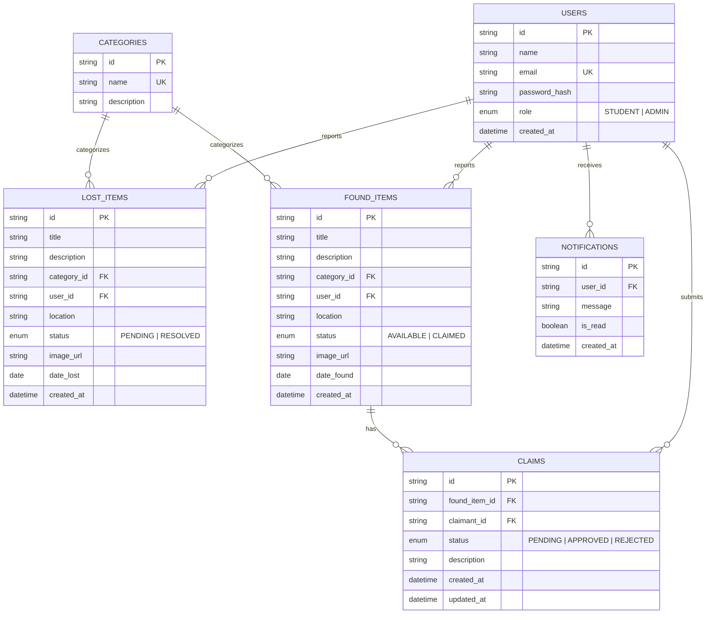

# ER Diagram — Campus Lost & Found Management System

## Entity-Relationship Diagram

---

## Relationships Explained

### 1. One User → Many Lost Items
A single student can report multiple lost items over time.
- Foreign key: `lost_items.user_id → users.id`
- Cardinality: **1:N**

### 2. One User → Many Found Items
A student who finds multiple items can report each one.
- Foreign key: `found_items.user_id → users.id`
- Cardinality: **1:N**

### 3. One Found Item → Many Claims
Multiple students can claim the same found item (only one will be approved).
- Foreign key: `claims.found_item_id → found_items.id`
- Cardinality: **1:N**

### 4. One Category → Many Items
Both lost and found items are classified under a single category.
- Foreign key: `lost_items.category_id → categories.id`
- Foreign key: `found_items.category_id → categories.id`
- Cardinality: **1:N** (for each item table)

### 5. One User → Many Notifications
A user receives multiple notifications (claim approved, rejected, etc.).
- Foreign key: `notifications.user_id → users.id`
- Cardinality: **1:N**

---

## Key Design Decisions

| Decision | Rationale |
|---|---|
| UUID primary keys | Avoids sequential ID enumeration attacks |
| Separate `LostItems` and `FoundItems` tables | Different fields (`date_lost` vs `date_found`), different statuses, different workflows |
| `Claims` links only to `FoundItems` | Claims are made on items that have been found and reported |
| `Notifications` as its own table | Persistent notification history; can be marked read/unread |
| Trigger on `Claims` | Demonstrates DB-level constraint enforcement — status update cascades automatically |
